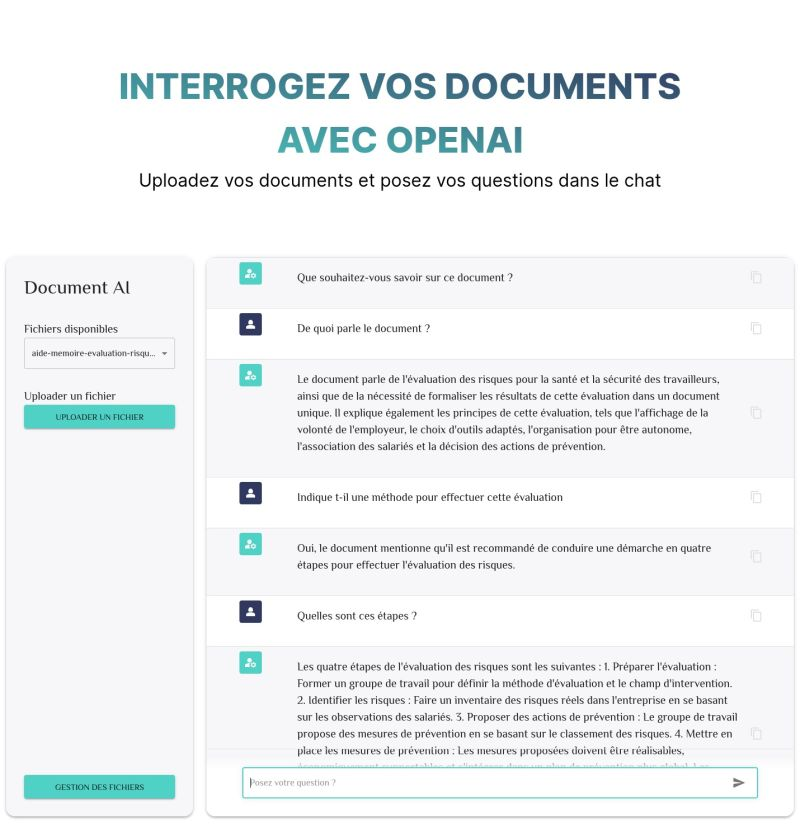

Ceci est un projet [Next.js](https://nextjs.org/) créé avec [`create-next-app`](https://github.com/vercel/next.js/tree/canary/packages/create-next-app).

[](https://github.com/ellerbrock/open-source-badges/)
[](https://opensource.org/licenses/mit-license.php)

# Application Document AI de [ByLudivine.com](https://www.byludivine.com)

Vous trouverez, dans ce dépot, le code source de mon application Document AI.

> **il s'agit d'un environnement de développement, n'utilisez pas ce code et la configuration Docker associée en production**

## Description

Document AI est une application de chat vous permettant de communiquer avec vos documents au format pdf, txt, docs, csv, json en utilisant un LLM comme ChatGPT. Ces documents sont téléchargés et traités (vectorisation, stockage) via l'application afin de pouvoir être utilisés dans le chat.
Cette application nécessite une clé API OPENAI pour fonctionner.

Les compétences techniques à connaitre pour déployer cette application sont énumérées ci-dessous. Celles-ci ne feront pas l'objet d'explication au sein de ce README.

- savoir utiliser docker / docker-compose
- savoir créer une clé API sur OPENAI
- connaitre Next.js

<p align="center">

</p>

## Déploiement

### Cloner le dépot github

Assurez-vous de disposer de git, Docker et docker-compose installés sur votre environnement.
Les commandes ci-dessous sont effectuées sous Linux

```
git clone https://github.com/ludibel/Document_AI
```

### Créer le fichier des variables d'environnement

Placez-vous dans le répertoire du projet et renommez le fichier des variables d'environnement .env.example en .env

```
mv .env.example .env
```

### Déployer les containers docker

```
docker-compose up
```

### Accéder à l'application

Rentrez en shell dans le conteneur Node qui héberge l'application

```bash
docker exec -it docker_node sh
```

L'invité de commande suivant apparait

```
 /app #
```

Exécutez les commandes suivantes pour installer et lancer l'application

```
/app # yarn install
```

```
/app # yarn dev
```

Ouvrez votre navigateur web et rendez-vous sur http://localhost:3000

Pour visualiser les collections chromadb rendez-vous sur http://localhost:8000/api/v1/collections

## Contribuer au projet

### Licence

Le projet est sous la licence open source [MIT](LICENSE.md)

### Code de conduite

Afin de contribuer dans un environnement sain et convivial merci de respecter le [code de conduite](CODE_OF_CONDUCT.md)

### Comment contribuer

Vous trouverez l'ensemble des directives à suivre pour contribuer au projet dans le fichier [Contributing](CONTRIBUTING.md)
